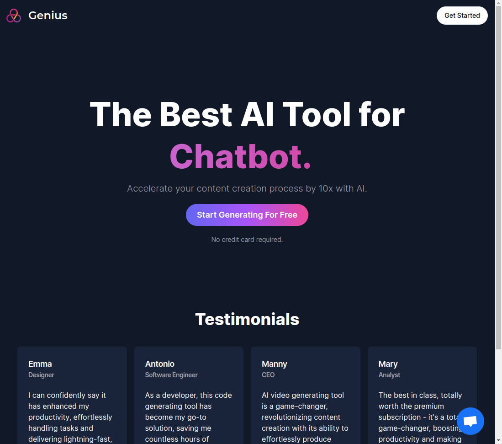
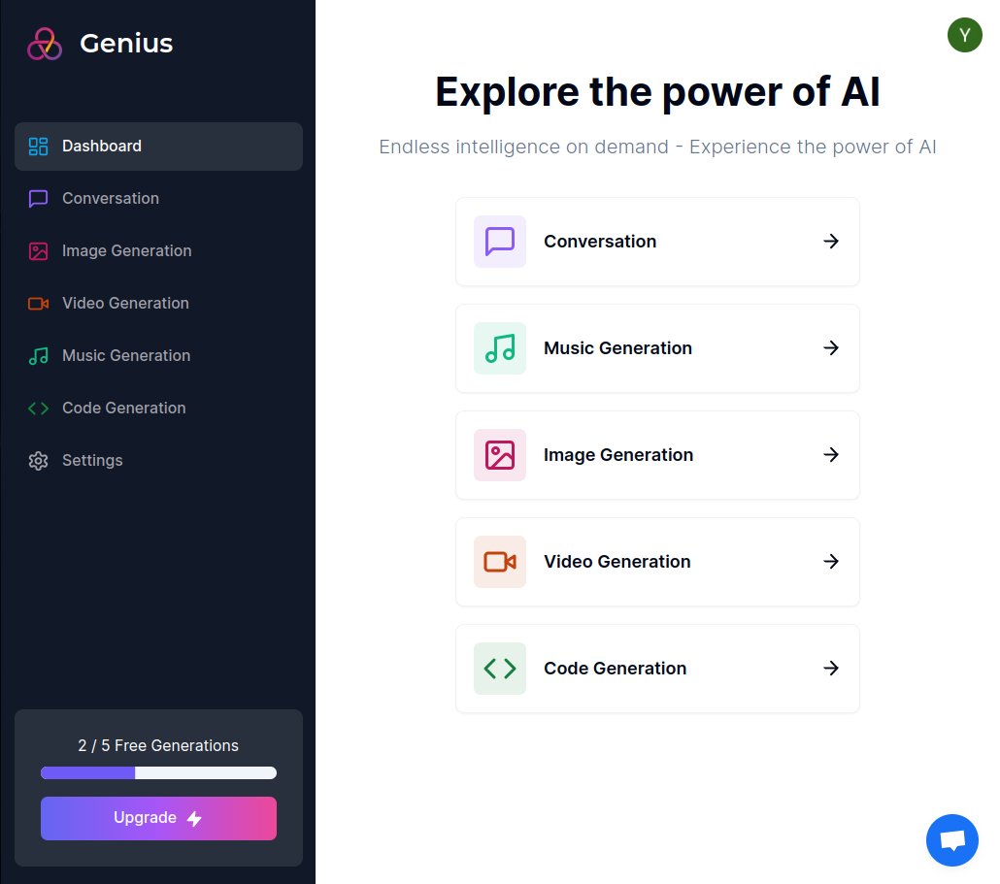
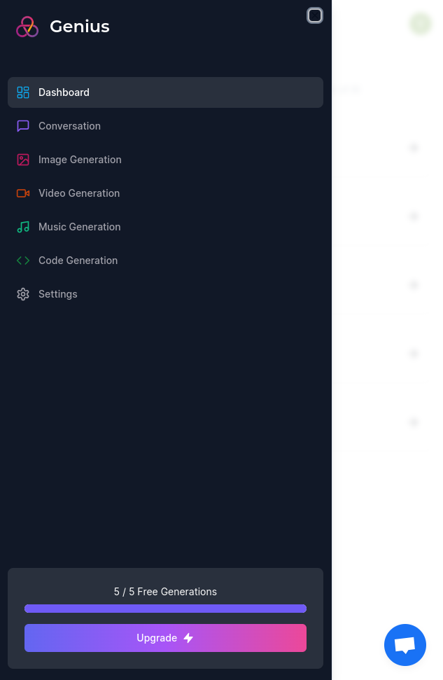
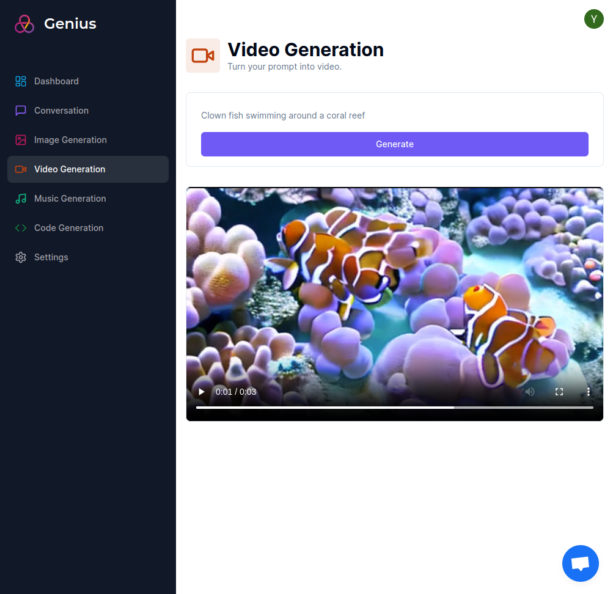
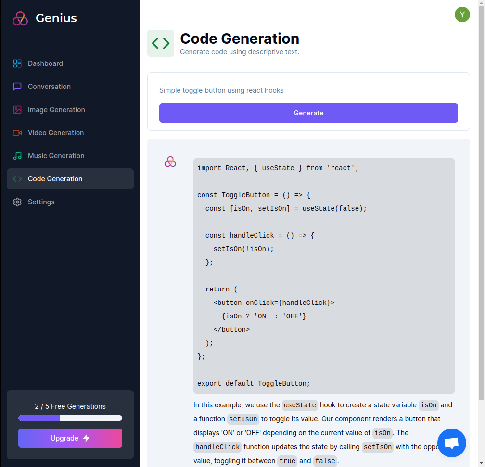
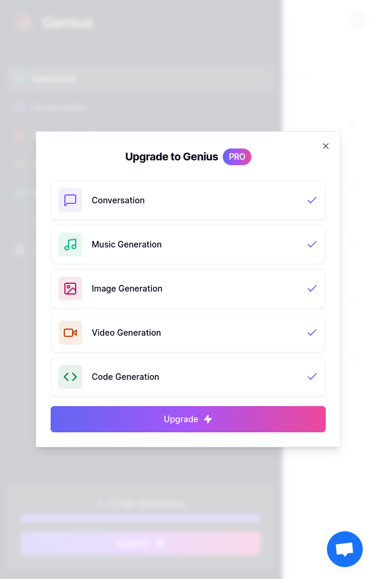
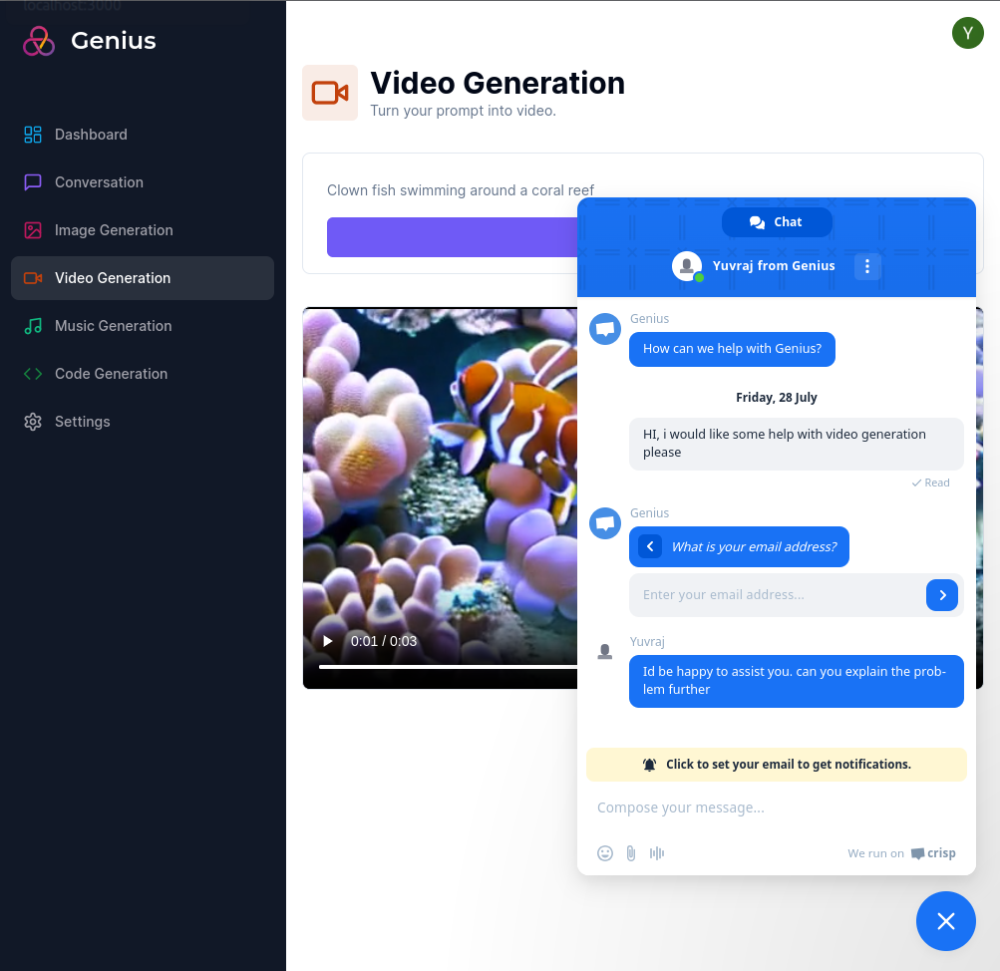

# Full Stack SaaS AI Platform with Next.js 13



## Introduction

Aim: Develop a full stack buld of an SaaS AI Platform with Next.js 13, React, Tailwind, Prisma, Stripe

## Deployment Link

https://full-stack-saas-ai.vercel.app/

Note: Some compelx AI generation request may timeout, displaying "Something went wrong"

This is due to the timeout set by API routes, and will be will be resolved shortly using 
Vercel AI SDK with the Edge Network, providing faster generation and content streaming suppoort

## Technology Used
- TSX | Typescript | Javascript 
- React
- Tailwind (shadcn/ui) CSS
- PlanetScale DB Platform
- OpenAI
- ReplicateAI 
- Prisma
- Stripe
- Crisp Messaging Platform
- Clerk

## Features:
- Tailwind design
- Tailwind animations and effects
- Full responsiveness

Web          |  Mobile sidebar
:-------------------------:|:-------------------------:
  |  

- Clerk Authentication (Email, Google, and Social Logins)
- Client form validation and handling using react-hook-form
- Server error handling using react-toast
- Image Generation Tool (OpenAI)
- Video Generation Tool (ReplicateAI)
- Conversation Generation Tool (OpenAI)
- Music Generation Tool (ReplicateAI)
- Code Generation Tool (OpenAI)

Video generation          |  Code generation
:-------------------------:|:-------------------------:
  |  


- Page loading state
- Stripe monthly subscription
- Ability to upgrade from free tier to pro plan with unlimited generations/usage
- Ability to manage - upgrade, remove subscription
- Free tier with API limiting

Free Tier          |  Pro Tier
:-------------------------:|:-------------------------:
  |  

- POST, DELETE, GET routes in route handlers
- Fetch data in server react components by directly accessing database without API
- Integrating messaging platform for clients using Crisp Chat

App-wide asistance          |  Crisp Chat
:-------------------------:|:-------------------------:
  |  


## Prerequisites

**Node version 18.x.x**

### Cloning the repository

```shell
git clone https://github.com/Yuvraj-26/Full-Stack-AI-SaaS.git
```

### Install packages

```shell
npm i
```

## Clerk 
- Create Application for Next.js
- Copy Clerk credentials

## OpenAI nad ReplicateAI
- Copy OpenAI API key and ReplicateAI API token

## Stripe 
- Copy Stripe secret key
- Download Stripe CLI
- Stripe login and match pairing code using:
```shell
stripe login
```
- forward events to the webhook and copy webhook signing secret using:
```shell
stripe listen --forward-to localhost:3000/api/webhook
```
### Setup .env file

```js
NEXT_PUBLIC_CLERK_PUBLISHABLE_KEY=
CLERK_SECRET_KEY=

NEXT_PUBLIC_CLERK_SIGN_IN_URL=/sign-in
NEXT_PUBLIC_CLERK_SIGN_UP_URL=/sign-up
NEXT_PUBLIC_CLERK_AFTER_SIGN_IN_URL=/dashboard
NEXT_PUBLIC_CLERK_AFTER_SIGN_UP_URL=/dashboard

OPENAI_API_KEY=
REPLICATE_API_TOKEN=

DATABASE_URL=

STRIPE_API_KEY=
STRIPE_WEBHOOK_SECRET=

NEXT_PUBLIC_APP_URL="http://localhost:3000"
```

### Setup Prisma

Add MySQL Database (PlanetScale)

```shell
npx prisma db push
npx prisma generate

// to reset the database
npx prisma migrate reset


```

### Start the app

```shell
npm run dev
```

Open [http://localhost:3000](http://localhost:3000) with your browser to see the result.


## Available commands

Running commands with npm `npm run [command]`

| command         | description                              |
| :-------------- | :--------------------------------------- |
| `dev`           | Starts a development instance of the app |
| `lint`          | Checks code for errors and warnings |


## Deploy on Vercel

The easiest way to deploy your Next.js app is to use the [Vercel Platform](https://vercel.com/new?utm_medium=default-template&filter=next.js&utm_source=create-next-app&utm_campaign=create-next-app-readme) from the creators of Next.js.

Check out our [Next.js deployment documentation](https://nextjs.org/docs/deployment) for more details.
